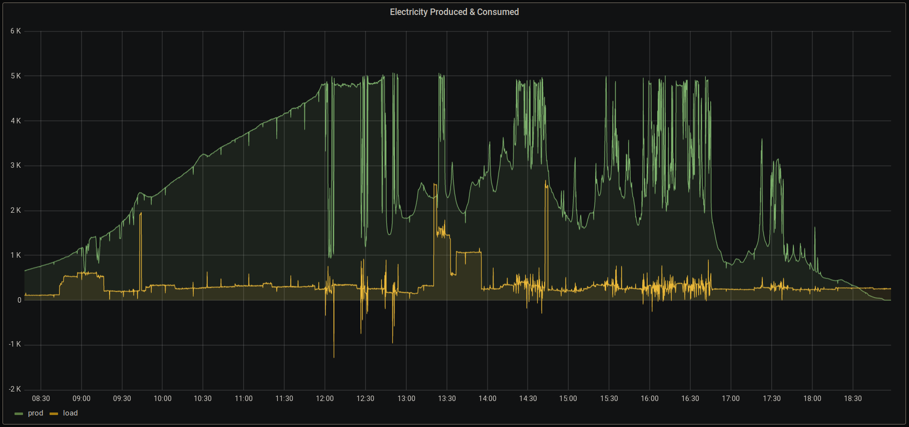

# Contents

```
├── collector.py : The main script that fetches data and inserts into a database
├── db : Contains 
│   ├── electricity.sql : PostgeSQL/TimescaleDB schema for the database table
│   └── home.sql : PostgeSQL/TimescaleDB schema for the database
├── grafana
│   ├── electricity-prod-load-graph-grafana.json: A simple grafana dashboard with production and load metrics
└── electricity-stats-collector.service : systemd unit file for running as a service
```

A simple [Grafana dashboard](grafana/electricity-stats.json) is also included.

